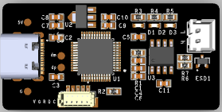

## CanAble for stm32F072x

### Hardware

- top

- bottom

### FrameWare

| name | type          |
| ---- | ------------- |
| MCU  | STM32F072C8T6 |
| CAN  | SN65HVD232    |

## Thanks 

[candleLight_fw](https://github.com/candle-usb/candleLight_fw)